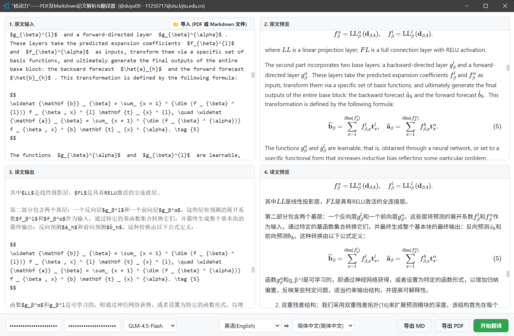

<p align="center">
  <br>
  
</p>
<br>

# NPA “Nuclear Powered” Paper Analyzer and Translator

### 🌍 Documentation Language

[**简体中文**](./README.zh-CN.md) | [**English**](./README.md) | [**Tiếng Việt**](./README.vi.md)

## 📖 Project Introduction

**NPA** (English: _"Nuclear Powered" Paper Analyzer and Translator_; Simplified Chinese: _“核动力”论文解析与翻译器_; Vietnamese: _"Hạt Động Lực" - Trình Phân tích và Dịch Luận văn_) is a local desktop application based on Python Webview, designed to alleviate the pain points faced by non-native English academic researchers when reading English literature. This project combines modern frontend technologies with powerful backend AI services to achieve high-fidelity parsing from PDF documents to Markdown, as well as professional academic translation powered by large language models. The system uses **PyWebview** as the GUI framework, **Flask** to build a local backend service, and **Nuitka** to package the application into standalone executables, enabling cross-platform operation on Windows, macOS, and Linux.

## ✨ Key Features

**📄 High-Fidelity PDF Parsing**
* Integrates the [**MinerU**](https://mineru.net/) API to accurately parse complex academic PDFs (including double-column layouts, formulas, and tables) into structured Markdown format.
* Automatically processes formula recognition and layout, preserving the original document structure.

**🤖 Professional Academic Translation (Zhipu AI)**
* Built-in integration with the [**Zhipu AI GLM Large Language Models**](https://open.bigmodel.cn/) for professional academic text translation.
* **Streaming Output**: Translation results are rendered in real time without waiting for the entire text to complete.
* **Terminology Consistency**: Maintains a global terminology glossary to ensure consistent translation of proper nouns throughout the document.
* **Format Preservation**: Strictly preserves Markdown headers, bold text, lists, code blocks, and LaTeX formulas without breaking the original layout.

**🖥️ Localized GUI Interface**
* A lightweight desktop application based on PyWebview. High-quality Markdown rendering and formula display are achieved using **marked.js** and **MathJax**.
* Provides interactive features such as file selection, API key management, and side-by-side translation preview.

</img>

## 💡 Usage Instructions

1. You can download prebuilt executable files from the Release page of this project. Of course, you may also choose to build it yourself or run the Python source code directly.

2. **Configure API Keys**:

* Please visit the official MinerU website [**https://mineru.net/**](https://mineru.net/) to apply for a MinerU API Key for PDF parsing. As of now (January 2026), applying for a MinerU API Key is **completely free**. The daily quota supports up to 10,000 PDF parsing requests, with the first 2,000 pages processed via a fast lane. Remaining quotas are restored the next day, which is sufficient for most users’ regular needs.

* Please visit the Zhipu AI Open Platform [**https://open.bigmodel.cn/**](https://open.bigmodel.cn/) to apply for a Zhipu API Key for translation services. Zhipu AI provides multiple large language model options, some of which are free and can be called **without any usage limits**, subject to official documentation. You may also subscribe to paid plans on the Zhipu website if needed. The input tokens consist of the document’s original Markdown text + built-in software instructions (within 300 Chinese characters) + a certain amount of JSON-formatted terminology glossary (the longer and more specialized the document, the larger the glossary). The output tokens consist of the translated Markdown text (translated content) + a certain amount of JSON-formatted terminology glossary.

3. **Parse PDF or Markdown Documents**:
Click “Import” and select a PDF file. The program will automatically upload it to MinerU for parsing. Once parsing is complete, the parsed Markdown content will be automatically loaded into the preview area. This process consumes MinerU’s daily quota. If you import a Markdown document, it will be loaded directly into the preview area without consuming any quota.

4. **Translate**:
You can first configure translation parameters (model, source language, target language). Then click the “Start Translation” button. The right panel will display the translation results in real-time streaming mode. After clicking the button, there may be a delay of about ten seconds to initialize the API connection. Please be patient.

5. **Export**:
After translation is complete, you can export the result as a Markdown file or a PDF file. The PDF export feature is based on the “Print” functionality of the webview kernel and depends on your operating system. After setting the parameters, simply select “Save as PDF”.

## 📂 Project Structure

Below is the core file structure of the project and a description of each component:

```text
NPA-Paper-Analyzer-and-Translator/
├── main.py ........................... [Core Entry] Application entry point, initializes the GUI window, API bridging, and terminology-consistent LLM document translation logic
├── flask_server.py ................... [Local Backend] Flask server responsible for serving frontend static resources (HTML/JS/images) and file streams
├── call_api.py ....................... [Translation Service] Wraps the Zhipu AI API, handling streaming requests, system prompts, and JSON result parsing
├── analysis_pdf.py ................... [Parsing Service] Wraps the MinerU API, handling PDF upload, parsing status polling, and result download and extraction
├── key_manager.py .................... [Configuration Management] Handles reading and persistent storage of API Keys (npa_api_config.ini)
├── split_text.py ..................... [Text Processing] Splits long text into smaller chunks based on token limits to prevent API overflows
├── tempdir_manager.py ................ [Temporary Files] Manages temporary directories and files generated during parsing and ensures cleanup
├── close_splash.py ................... [UI Utility] Helper script used to close the splash screen
├── build_windows.bat ................. [Build Script] Windows build script (using Nuitka)
├── build_macos.sh .................... [Build Script] macOS build script
├── build_linux.sh .................... [Build Script] Linux build script
├── requirements.txt .................. [Dependencies] Python dependency list
├── LICENSE ........................... [License File] License information
├── npa-icon.png ...................... Application icon
└── static/ ........................... [Frontend Assets] Contains index.html, CSS, JS, and MathJax font files
    ├── index.html
    ├── js/
    │   ├── t-loading.js
    │   └── ...
    └── npa-icon.png

```

## 🛠️ Developer Section: Environment Setup and Development

### Prerequisites

* Python 3.10 or higher, Python 3.13 is recommended.
* [MinerU API Key](https://mineru.net/) (for PDF parsing)
* [ZhipuAI API Key](https://open.bigmodel.cn/) (for translation)

### 1. Clone the Project

```bash
git clone https://github.com/your-repo/NPA-Paper-Analyzer-and-Translator.git
cd NPA-Paper-Analyzer-and-Translator
```

### 2. Install Dependencies

It is recommended to use a virtual environment:

```bash
# Create a virtual environment
python -m venv venv
# Activate the environment (Windows)
venv\Scripts\activate
# Activate the environment (Mac/Linux)
source venv/bin/activate
# Note: On Linux systems, you must install QT or GTK related dependencies to ensure PyWebview works properly.

# Install dependencies
pip install -r requirements.txt
```

### 3. Run the Source Code

```bash
python main.py
```

## 📦 Build It Yourself

**Build Requirement: You must use the official clean CPython downloaded from `python.org`. Any other Python interpreters (such as Anaconda, Miniconda, PyPy, etc.) are not supported.**

This project uses **Nuitka** for compilation and packaging to generate standalone, high-performance executables. Please run the corresponding build script according to your operating system. The scripts include most of the necessary build steps. If errors occur, please follow the script output instructions to resolve them. Detailed build steps are not elaborated here.

### Windows

Double-click or run from the command line:

```bat
build_windows.bat
```

### Linux

Grant execution permission and run:

```bash
chmod +x build_linux.sh
./build_linux.sh
```

### macOS

Grant execution permission and run:

```bash
chmod +x build_macos.sh
./build_macos.sh
```

## ⚠️ CAUTIONS

**IMPORTANT NOTICE: DUE TO THE FACT THAT THE PARSING FUNCTIONS AND TRANSLATION FUNCTIONS OF THIS SOFTWARE RELY ON APIS, YOU ARE STRICTLY PROHIBITED FROM UPLOADING ANY TYPE OF NON-PUBLIC FILES, INCLUDING BUT NOT LIMITED TO CLASSIFIED FILES AND PRIVATE OR PERSONAL FILES. ANY INFORMATION SECURITY ISSUES CAUSED THEREBY, INCLUDING BUT NOT LIMITED TO THE LEAKAGE OF CONFIDENTIAL INFORMATION OR PERSONAL PRIVACY, OR EVEN ACTS THAT CONSTITUTE CRIMINAL OFFENSES SUCH AS ENDANGERING NATIONAL SECURITY, SHALL BE BORNE SOLELY AND IN FULL BY THE SOFTWARE USER (YOU). THE PROJECT DEVELOPER AND THE API PROVIDER SHALL BEAR NO RESPONSIBILITY OR LIABILITY WHATSOEVER. IN ADDITION, THE PDF DOCUMENT PARSING AND TEXT TRANSLATION FUNCTIONS OF THIS SOFTWARE INVOLVE AI CAPABILITIES AND MAY PRODUCE ERRORS. ALL OUTPUTS GENERATED BY THIS SOFTWARE ARE FOR REFERENCE PURPOSES ONLY AND MUST NOT BE USED IN ANY FORMAL CONTEXT, INCLUDING BUT NOT LIMITED TO LEGAL MATTERS, OFFICIAL DOCUMENTS, CONTRACTS, OR ANY PROFESSIONAL CONTENT. ANY LOSSES OR LEGAL LIABILITIES ARISING THEREFROM SHALL BE BORNE SOLELY BY THE USER (YOU), AND THE PROJECT DEVELOPER AND THE API PROVIDER SHALL BEAR NO RESPONSIBILITY OR LIABILITY WHATSOEVER.** _(The above notice was translated from the Chinese version by the GPT-5.2 model. In case of any dispute, the Chinese version shall prevail.)_

<details>

<summary>Chinese Translation</summary>

**重点须知：由于本软件的解析功能和翻译功能均依赖API，所以请严禁上传包括但不限于涉密文件和隐私文件的任何类型的非公开文件。由此造成机密泄露、隐私泄露等信息安全问题，甚至是导致危害国家安全等的构成犯罪的行为，全部责任均由软件使用者（您）承担。本项目开发者和 API 提供方均不承担任何责任。另外，本软件解析 PDF 文档和文本翻译的功能均涉及 AI 能力，有造成错误的可能，本软件的一切输出仅供参考，不可将本软件的输出用于法律、公文、合同、专业内容用途等任何正式场合，由此造成的损失或法律责任均由使用者（您）承担，本软件项目开发者和 API 提供方均不承担任何责任。**

</details>

<details>

<summary>Vietnamese Translation</summary>

**THÔNG BÁO QUAN TRỌNG: DO CHỨC NĂNG PHÂN TÍCH VÀ CHỨC NĂNG DỊCH CỦA PHẦN MỀM NÀY ĐỀU PHỤ THUỘC VÀO API, DO ĐÓ NGHIÊM CẤM TUYỆT ĐỐI VIỆC TẢI LÊN, BAO GỒM NHƯNG KHÔNG GIỚI HẠN, BẤT KỲ LOẠI TỆP KHÔNG CÔNG KHAI NÀO CÓ CHỨA TÀI LIỆU MẬT VÀ/HOẶC THÔNG TIN RIÊNG TƯ. MỌI VẤN ĐỀ AN TOÀN THÔNG TIN PHÁT SINH TỪ ĐÓ, BAO GỒM NHƯNG KHÔNG GIỚI HẠN Ở VIỆC RÒ RỈ BÍ MẬT, RÒ RỈ QUYỀN RIÊNG TƯ, THẬM CHÍ CÁC HÀNH VI CẤU THÀNH TỘI PHẠM GÂY NGUY HẠI ĐẾN AN NINH QUỐC GIA, TOÀN BỘ TRÁCH NHIỆM ĐỀU DO NGƯỜI SỬ DỤNG PHẦN MỀM (BẠN) TỰ CHỊU. NHÀ PHÁT TRIỂN DỰ ÁN NÀY VÀ BÊN CUNG CẤP API KHÔNG CHỊU BẤT KỲ TRÁCH NHIỆM NÀO. NGOÀI RA, CÁC CHỨC NĂNG PHÂN TÍCH TÀI LIỆU PDF VÀ DỊCH VĂN BẢN CỦA PHẦN MỀM NÀY CÓ LIÊN QUAN ĐẾN NĂNG LỰC TRÍ TUỆ NHÂN TẠO (AI) VÀ CÓ KHẢ NĂNG PHÁT SINH SAI SÓT. MỌI ĐẦU RA CỦA PHẦN MỀM NÀY CHỈ ĐƯỢC CUNG CẤP VỚI MỤC ĐÍCH THAM KHẢO, TUYỆT ĐỐI KHÔNG ĐƯỢC SỬ DỤNG CHO CÁC VĂN BẢN PHÁP LÝ, VĂN KIỆN HÀNH CHÍNH, HỢP ĐỒNG, NỘI DUNG CHUYÊN MÔN HOẶC BẤT KỲ BỐI CẢNH CHÍNH THỨC NÀO. MỌI THIỆT HẠI HOẶC TRÁCH NHIỆM PHÁP LÝ PHÁT SINH TỪ ĐÓ ĐỀU DO NGƯỜI SỬ DỤNG PHẦN MỀM (BẠN) TỰ CHỊU; NHÀ PHÁT TRIỂN DỰ ÁN PHẦN MỀM NÀY VÀ BÊN CUNG CẤP API KHÔNG CHỊU BẤT KỲ TRÁCH NHIỆM NÀO.** _(Nội dung lưu ý nêu trên được dịch từ phiên bản tiếng Trung bởi mô hình GPT-5.2. Trong trường hợp có tranh chấp, phiên bản tiếng Trung sẽ được ưu tiên áp dụng.)_

</details>

## 👤 Project Developer

* **Du Yu** (Chinese: _杜宇_; Vietnamese: _Đỗ Vũ_)
* Email: <qluduyu09@163.com> or <11250717@stu.lzjtu.edu.cn>
* Address: School of Electronic and Information Engineering, Lanzhou Jiaotong University (Chinese: _兰州交通大学电子与信息工程学院_; Vietnamese: _Đại Học Giao thông Lan Châu, Học Viện Điện Tử Và Công Nghệ Thông Tin_)

</img>

## 📄 License

This project is released under an open-source license. For details, please refer to the [LICENSE](./LICENSE) file.

